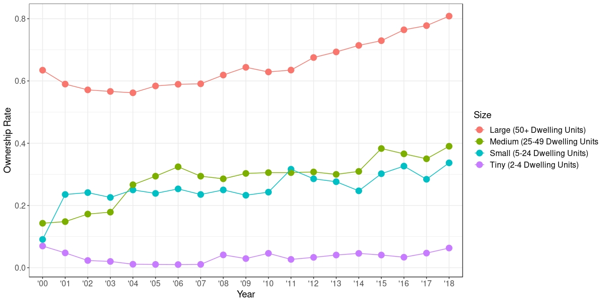

# Data Section

## Data Overview

I focus on the multi-family rental market since 2000 due to the availability of data. Information before this time period is sparse and less reliable. The first dataset that is fundamental to my research are records from the Durham Sheriff’s Department for summary ejectments (eviction filings) in Durham between 2004 and 2018. The second dataset I use are records from the Durham Tax Administration of all parcel-level sales transactions in Durham between 1997 and 2018. I also rely heavily on two parcel-level shape files from the Durham Tax Administration. The first of these files contains geometric boundaries for all of the parcels in Durham. The second file contains dwelling units for almost 94% of the parcels in Durham, which have been recorded and updated by the Lands Records/GIS division of the Durham County Tax Administration. Finally, I use a census tract shapefile from 2010, which features the most recent estimates of different demographic variables. The datasets I work with that originate from the Durham Sheriff’s Police Department and Durham Tax Administration are provided to me in collaboration with DataWorks.

My dependent variable, the eviction filings rate, comes from the summary ejectments records provided by the Durham’s Sheriff’s Department. Between January 2004 and December 2018, this dataset contains 197,594 observations, indicating there have been 197,594 evictions in Durham across all property sizes between January 2004 and December 2018. Relevant variables in this dataset include the address (where the eviction filing was served), the date (when it was served) and the docket number (a unique identifier).  

The parcel-level sales transaction data from the Durham Tax Administration contains approximately 241,870 observations, indicating there have been 241,870 sales of parcels in Durham between January 1997 and June 2018. Important variables in this data set include the parcel ID (unique identifier), the deed name (the person/entity that bought the parcel), information on the parcel address (where the parcel is located), the date sold (when the parcel was bought), and the deeded owner’s address (the address of the person/entity that bought the parcel). 

-------------------------------------------------------------------------------------
  Dataset                        Description            Observations           Source
---------------------- ------------------------------- -------------- ---------------
  Parcel-Level Sales     Deed information for                             Durham Tax
  Transaction Data       every entity that bought         241,870      Administration
                         bought a parcel in Durham                     
  
  Parcel-Level           Shapefile with all                                Durham Tax
  Shapefile              geometric boundaries for         116,859      Administration
                         every parcel in Durham
  
  Parcel-Level           Shapefile with information                    Lands Records/
  Shapefile with         on each rental property's        109,545     GIS division of
  Dwelling Units         total dwelling count                              Durham Tax
                                                                       Administration
  
  Eviction Filings       Information on all evictions     220,027      Durham Sheriff
                         filed in Durham                                   Department
  
  Parcel File            Owner information for parcels    91,823          Durham Tax
  From 2003              in Durham in 2003                            Administration
---------------------- ------------------------------- -------------- ---------------
Table: (\#tab:datasets) Description of Raw Datasets

\clearpage

## Data Manipulation

In this section, I provide a detailed outline of my data preparation and manipulation process. My analysis focuses on multi-family rental properties, so my first goal was to match evictions to parcels that mapped to apartment complexes. Specifically, I was interested in the evictions that fell within the geometric boundaries of apartment complexes. My first step was to subset my parcel-level sales transaction data to only contain the land use codes of multi-family dwellings. Thus, I filtered my Durham Tax Sales data to only include parcels with the following land use codes: “COM/ APARTMENT-DWG CONV”, “COM/ APARTMENT-GARDEN”, “COM/ APARTMENT-GARDEN S42”, “COM/ APARTMENT-HIGH RISE”, “RES/ MULTIPLE DWG’s”, “COM/ LIVING ACCOMM”, and “COM/ LIVING ACCOMN S42”. This left me with 2,154 observations, indicating there had been 2,154 transactions in multi-family dwellings since 1997.  

My next step was to add the total dwelling units for each parcel, so that I could determine eviction rates. I first filtered my parcel-level shapefile so that it only contained the unique parcels that were in my subset multi-family sales transactions data set. Next, I used a left join to join the parcel-level shapefile with the parcel-level shapefile that contained the dwelling unit information for each parcel, matching on parcel ID. The reason I did not simply use the latter file to begin with was because the former was more comprehensive. The latter did not have information on every single parcel in Durham.  

After this matching process, I was able to successfully retrieve dwelling unit counts for 689 of the 763 total multi-family parcels in Durham. There remained 18 parcels that did not have dwelling unit counts, 16 parcels that had a dwelling unit count of 0, and 40 parcels that had a dwelling unit count of 1, which was suspect since I had filtered for multi-family dwellings. For each of these 74 parcels, I researched and retrieved the apartment unit counts using a number of sources, including the Durham Tax Administration’s public website. I have documented how I retrieved the unit counts for each dwelling or the reasoning for why the parcel has been excluded in my research in my GitHub repository file, “missing_sum_du.csv.” At the end of this stage, I had a file that contained the dwelling units for each parcel in my sales transaction data.  

Next, I needed to clean and geocode my evictions data. First, I determined a spatial point for each of my evictions, so that I could establish which parcel boundary the eviction fell into. To do this, I used Google’s geocoding API service to convert each address into geographic coordinates. My next step was to match these evictions to my multi-family parcels. I transformed my parcel-level shapefile and my evictions data into spatial objects with the same coordinate reference system. Then, I merged the two datasets. Each eviction would map to a multi-family dwelling if the coordinates of the eviction intersected with any area of the multi-family dwelling in the parcel file.  

In this new merged dataset, each eviction was an observation. If the eviction occurred within a multi-family parcel’s boundary, the row in the merged dataset would contain information on the parcel ID and unique PIN of the parcel that the eviction occurred in. Evictions that did not fall into a parcel’s boundary meant that the eviction had not occurred in a multi-family dwelling, because they did not match anything in the multi-family parcel file. Thus, if the eviction did not match to a parcel ID and unique PIN, there would be an “NA” in that field, indicating that the eviction occurred in a different type of dwelling. In order to focus my analysis on the evictions that occurred at multi-family dwelling units, I simply subset my dataset to rows that did not have an NA in the parcel ID column.  

At this point, I came across an issue with the data that I needed to fix. After I joined the two datasets, I ended up with more rows of evictions than I had started with. It did not make sense to end up with more evictions after merging the evictions dataset with the parcel-file dataset. Further investigation revealed that this would occur because there were multiple units on a property that shared the same parcel ID. The evictions were double counted in these cases because the eviction would match to two different units on the same parcel, and thus create an extra row.  

I noticed that for the evictions that were being counted twice, the PIN for the eviction’s second entry had four extra characters added to it. Thus, in order to make sure evictions were not being double counted, I made any PIN that was not exactly 15 characters into an “NA”. From here, I could filter my data set to contain only rows where there was no “NA” under the PIN. This still did not completely solve the problem, so I then assigned a unique value to each eviction and after I merged, I could see which evictions were being duplicated. I then subset my data so that I was only keeping unique evictions in my data. At this point, I only had unique evictions matching to parcels and owners. I also subset my data to only include evictions after 2004, because there was a concern about missing data in 2003 and prior [^5]. I was eventually left with 45,531 observations, where each row in the dataset represented an eviction that occurred in a multi-family complex, and the parcel ID of that property.  

At this point, I was interested in matching each eviction to the owner of the parcel at the time eviction occurred. First, I needed to identify the date the eviction occurred. There were 15,590 cases (35 percent of the data) where the “Dateissued” variable for the eviction was missing. However, the “Statusdate” variable, which was the date the eviction was brought up in court, had no missing information. The average difference between the date issued and the status date variable was approximately 6.6 days, and it was reasonable to assume that the date the eviction was brought to court was still under the same owner as the date the eviction was issued, so I chose to use the “Statusdate” variable as a proxy for the date the eviction occurred.  

Next, I needed to identify a start and end date for each owner, so that I could match an eviction to an owner based on whether the eviction date fell between the start and end date of the owner at the same parcel. The start date was simply equal to the date the owner bought the parcel, or “date sold”. The end date, then, was equal to the date the parcel was sold to another owner. If no such date existed, this implied the listed owner was still the current owner. Thus, I set the end date equal to when the dataset was last updated: December 31, 2018. I then merged my evictions data with my new dataset of owners from my parcel sales transaction data, so that each eviction mapped to an owner based on the date it had occurred.  

Through this process, there were a number of imperfect data issues that I needed to make a decision about how to handle, and I outline them here. First, there were 380 cases where the parcel would trace to two or more owners that appeared to buy the same parcel on the same date. I reached out to the Durham Tax Administration about this and they sent over a new parcel-level sales transaction dataset with a deed page for each transaction, letting me know that the beneficial owner of that property would be the owner on the last deed page. Thus, I subset my data so as to only have the beneficial owner appear as a buyer for that property on that day.  

Secondly, after joining my evictions data with my owner data, 5% of the evictions originally did not match an owner. This occurred because if an owner had purchased a property before 1997, they were not included in the parcel-level sales transaction data, and therefore the evictions had no owner to match. In order to find the beneficial owner of the property in these cases, I acquired a historical parcel file from 2003 from DataWorks, which had the current owner listed at the time. It was reasonable to assume that the owner had owned this property since 2000 because there were no transactions stating otherwise.  

After adjusting for this, there were still evictions that were not matching to parcels or owners. I looked up each of these parcels, spatially, and realized that since 2003, certain parcel names had changed so that there was a new parcel ID and an old parcel ID. This usually occurred if the parcel had split into two units or joined together. Thus, I coded in a crossover so that all of my datasets would refer to same parcel with the same parcel ID and deleted any duplicates that had been created from the old data set.  

Finally, I noticed cases in my dataset where a parcel would get transferred from what appeared to be one owner to another in the span of a couple weeks, usually more than once. After I had traced each of these owners back to a specific entity, I found that in 131 of the cases, this was actually the same owner transferring the property across different shell company names. I decided that if the start date of one entity I had traced was equal to the end date of the same entity, these should not be considered two different transactions. Thus, if this was the case, I considered them to be the same exact transaction and deleted the duplicates.  

After my data cleaning and data manipulation process, I ended up with 2,166 observations in my parcel-level sales data, signaling there had been 2,166 different owners of multi-family rental properties since 2000, and there were 45,531 evictions at these properties between 2004 and 2018.  

## Owner Type Identification

As previously mentioned, I traced every owner in the parcel-level sales transaction dataset back to its original entity, if one existed, and also coded various other characteristics of each owner. It is important to note that this was a meticulous hand-coding process, and so its degree of error is difficult to estimate. Because I did it alone, one error term that is often present with hand-coding – variability between coders – is not relevant here. Table \@ref(tab:characs) below provides insight into all of the different variables I encoded: 

-------------------------------------------------------------------------------------
 Identifier                                                               Explanation
------------------------ ------------------------------------------------------------
  RHFS Classification      The Rental Housing Finance Survey separates investors into individuals and non-individuals, and further distinguishes between non-individuals as: Individual Investors, trustee for estate, LLP, LP, or LLC, tenant in common, general partnership, REIT, real estate corporation (I exchange this with business corporate), housing cooperative, non-profit organization and other, and I add investment firm, REIT and private equity firm.
  
  Corporate/Other/         An indication of whether the owner is a corporate owner (LLP, LP, or LLC, business corporation, investment firm, REIT or private equity firm); other (Non-Profit Corporation, bank, GSE, trustee of estate or estate, Durham Housing Authority); Individual (Individual under Deed name); Unclear (unclear or missing, owner cannot be located or verified externally) based on my RHFS classification.
  Individual/Unclear 
  
  Umbrella Name            The name of the entity that the deed name traces back to, whether or not it is the same as the deed name listed. 
  
  Out-of-State             An indication of whether the owner's mailing address is outside of North Carolina.
  
  15+ Dwellings Under      An indication of whether the owner owns over 15 rental properties.
  Same Ownership
  
  Rental Property Size     The Rental Housing Finance Survey separates the size of multi-family rental properties into tiny (2-4 units), small (5-24 units), medium (25-49 units) and large (50+ units).
------------------------ ------------------------------------------------------------
Table: (\#tab:characs) Landlord Characteristics 

I begin with a classification of the entity based on the Rental Housing Finance Survey’s classifications. I add investment firm, REIT and private equity firm as more nuanced classifications to the list, as well. I define “Corporate” as any entity that is classified by Bloomberg or Manta as a business corporation, financial institution (i.e. an investment firm or private equity firm), a real-estate corporation, REIT, or LLP, LP or LLC. I do not include non-profit corporations, banks, government sponsored enterprises, public housing agencies or trustees of estates. One important limitation with my corporate indicator is the difficulty in disentangling the true ownership properties of an LLC, LP or LLP. It is unclear from this demarcation whether the entity traces back to one individual or a large institution. This is an important limitation of the dataset since a primary goal of my thesis is to compare individuals to large corporate institutional owners. I conduct the same analysis excluding these owners and find no significantly different results. However, if there was an interest in separating these entities further, a rigorous hand-coding process would need to be used.  

In order to find information about each entity and trace each entity back to its “Umbrella Name”, I used a systematic approach to research each owner in the parcel-level sales transaction dataset. I began by looking up the deed name of the owner in the North Carolina Corporations website (sosnc.gov). Often times, the deed name would be listed in the North Carolina Corporations website and there would be a mailing address different from the one in the parcel-level sales transaction dataset. This mailing address would often be outside of North Carolina and googling the mailing address would help trace the shell company name back to a larger entity.
If the deed name was not listed in the North Carolina Corporations website (less than 10 percent of the time), I googled the deed name and the addresses under the deed address columns in the dataset. If these also did not trace back to any clear entity, I then looked to see if the owner’s deed name or address existed anywhere else in the dataset to see if there was more information provided elsewhere. If all of these methods failed, I labelled this owner as Unclear. Otherwise, I would follow my research to verify what entity the listed owner actually traced back to. I mainly relied on Bloomberg, Manta, and LinkedIn to verify my research. I kept tract of every source I found my information on, as well as an explanation of how I ultimately arrived at the umbrella entity.  

As part of my encodings, I included an indicator for whether the entity is based out of state or in-state. I also included an indicator for whether the entity owns more than 15 properties. The motivation behind each of these was to examine the phenomenon of the “distanced” landlord, as discussed in my Literary Review. Finally, I also included a classification for the rental property’s size based on the Rental Housing Finance Survey.  

At this point, it was possible to do various different analyses with the data. I present summary statistics on all multi-family properties and total evictions that they are accountable for in Table \@ref(tab:sumstats) below. As we can see from this table, while the largest (50+) units only represent 7.5 percent of all properties, 76% of all evictions filed occurred by owners of these units.  

-------------------------------------------------------------------------------------
 Rental     Total # Of    Mean # of     Median #       Proportion of      Total # Of
 Property   Properties    Dwelling      Of Dwelling    All Multi-Family    Evictions
 Size                     Units         Units         Dwellings          Between 2004
                                                                             and 2018
---------- ------------- ------------ --------------- ------------------ ------------
Tiny           443	        3.3	          4	             58.3 percent         3,249
(2-4 
Units)

Small          204	        11.6	        10	           26.9 percent         3,087
(5-24 
Units)

Medium         55       	  36.2	        36	           7.2 percent	        2,515
(25-49 
Units)

Large          57	          141.2         118	           7.5 percent	        36,680
(50+ 
Units)
---------- ------------- ------------ --------------- ------------------ ------------
Table: (\#tab:sumstats) Summary Statistics on Multi-Family Rental Properties

## Evictions in Durham

In Figure \@ref(fig:evicrates), I present the changes in average eviction rates across multi-family properties in Durham since 2004. Each data point is calculated by summing up all of the evictions that occurred in that property size in that year in Durham and dividing by the total number of dwelling units in Durham in that property size group. 

Eviction Rates Across Different Property Sizes in Durham Between 2004 and 2018

First, it is evident that year is intimately related with eviction filing rates. Across all property sizes, we clearly see the elevated rates of eviction filings in the years leading up to the financial crisis, and the precipitous drop in eviction filing rates after 2011. We also see that these eviction rates vary quite drastically across different dwelling unit sizes, and the distributions of the eviction rates across time is also varied. Specifically, in the largest dwelling units, the max average eviction rate is a little under 3.5 percent, whereas in the tiniest dwelling units, the max average eviction rate reaches 10 percent.  

Furthermore, we also see that the trends in eviction rates vary. In the largest dwelling unit sizes, eviction rates gradually increased between 2004 and 2008, and eventually peaked in 2010, whereas in the smallest and tiniest property sizes, the eviction rate actually stayed near the same level between 2004 and 2009. Finally, in the past 2 years, eviction rates have increased across all property sizes, but not in the same relative manner. For example, relative to historical rates, the average eviction rate has spiked more dramatically in small and medium units than in tiny and large property sizes. Overall, these different suggest that different trends are present in different property sizes. While it may not be necessary to separate medium and small properties in my analysis since the range of eviction rates are quite comparable, it may be useful to treat large and tiny properties as separate groups.  

\clearpage 

Next, I look at how eviction rates differ across racial and economic variables. In Figure \@ref(fig:dems), I calculate the average eviction rate by tract using the total number of evictions between 2004 and 2018 and dividing by the total number of multi-family dwellings in each tract, then scaling to get a yearly average eviction rate.  

The Impact of Eviction Rates on Different Demographics

I find that the higher the percentage of African American residents and Hispanic residents in a tract, the higher the average eviction rate is. I also find that the eviction rate is slightly higher in more impoverished neighborhoods. Finally, the higher the percentage of white residents in a tract, the lower the average eviction rate is on average across tracts. It becomes clear through these graphs that demographics and eviction rates are highly correlated in Durham.

\clearpage 

## Ownership Changes in Durham

I begin by looking at ownership of properties over time. Table \@ref(tab:ownership) presents the total number of properties and dwelling units owned by each type of owner in each property size between 1997 and 2018. The results suggest that corporates own the largest number of units in Durham, mainly concentrated in their ownership of the largest properties. Also, individuals are the main owners of the smallest property sizes, as we may have expected.

-------------------------------------------------------------------------------------
  Owner Type       Property Size            Total Properties         Total Dwelling
                   (Units)                  Owned                    Units Owned
---------------- ------------------------ ----------------------- -------------------
Corporate          Tiny (2-4)	              310                      1,044

Corporate          Small (5-24)	            172                      2,246

Corporate          Medium (25-49)	          72	                     2,716

Corporate          Large (50+)	            388	                     88,886

Individual         Tiny (2-4)               752	                     2,402

Individual         Small (5-24)	            109	                     1,101

Individual         Medium (25-49)           22	                     789

Individual         Large (50+)	            30	                     5,247

Other              Tiny (2-4)               147	                     453

Other              Small (5-24)	            50	                     645

Other              Medium (25-49)           28	                     1,055

Other              Large (50+)              20                  	   3,613

Unclear	           Tiny (2-4)               19                  	   56

Unclear	           Small (5-24)             10                  	   99

Unclear	           Medium (25-49)           2	                       68

Unclear	           Large (50+)	            35                  	   8,126
---------------- ------------------------ ----------------------- -------------------
Table: (\#tab:ownership) Summary Statistics on Multi-Family Property Ownership

Next, I look at how the ownership of rental properties in Durham have changed since 2000 across different property sizes. In Figure \@ref(fig:corpchanges), we can see that since 2000, the proportion of properties under corporate ownership has increased across all property sizes.  Specifically, in small and medium sized dwelling units, the proportion of properties under corporate ownership has flipped from being a minority (~40 percent) to a majority (between 62-72 percent) of ownership share. In the largest units, corporate ownership has increased from around 75 percent to 90 percent of all properties, and even in the tiniest units, we have seen corporate ownership increase slightly from around 30 percent to 35 percent ownership share. 

Proportion of Properties Under Corporate Ownership Across Different Property Sizes

Next, I look to see how ownership amongst corporate owners has changed: specifically, I am interested to see if more owners are based out-of-state. In Figure \@ref(fig:statechanges), we can see that the proportion of properties under corporate ownership that are based out-of-state has increased across all property sizes other than the smallest units, where it has stayed the same. In the largest property size, the proportion of properties owned by out-of-state corporates has risen from around 62 percent in 2000 to 80 percent in 2018. In the small and medium property sizes, out-of-state ownership has more than doubled from around 10 – 15 percent in 2000 to around 30 – 40 percent by 2018.

Proportion of Corporate Ownership Based Out-of-State

Overall, there is concrete evidence that the composition of multi-family landlords in Durham has changed.  In both of these graphs, we can see that the most drastic changes in ownership are occurring in the small and medium sized property units, though almost all property sizes are impacted in some way. 
