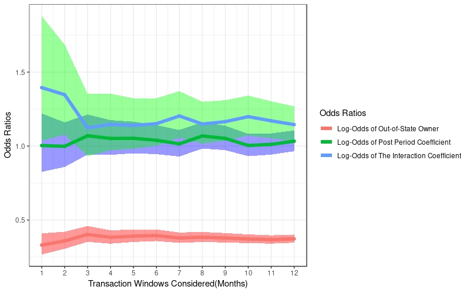

# Results

## Eviction Rates of Corporate Compared to Individual Landlords

I begin with an investigation of whether the eviction filing rates of corporate versus individual owners vary significantly surrounding a transaction. Because I use a binomial distribution, I convert the exponents of the coefficients of my regression into Odds Ratios representing the likelihood of eviction as compared to a baseline. Here, the baseline of “1” represents an individual’s likelihood of filing an eviction in the pre-transaction period. I present summary statistics of my findings below, and the full regression results can be found in Appendix A, Table A1.

--------------------------------------------------------------------------------------
                           Odds Ratio        CI Lower	   CI Upper	              Betas
------------------------ ----------------- ------------ ----------- -----------------
  Corporate, Pre/        0.25              0.23         0.28            $$exp(B_{1})$$
  Individual, Pre                
                                              
  Individual, Post	     1.06           	 0.93	        1.20	          $$exp(B_{2})$$
  / Individual, Pre
  
  Corporate, Post / 	   0.28	             0.19	        0.42	    $$exp(B_{1} + B_{2} +B_{3})$$
  Individual, Pre
  
  % African American 	   8.48	             7.14	        10.08	          $$exp(B_{4})$$
  In Tract
  
  Average Household 	   1.00	             1.00	        1.00	          $$exp(B_{5})$$
  Income 
------------------------ ----------------- ------------ ----------- -----------------
Table: (\#tab:res1) Summary Statistics for Owner Type 1 = Corporate v. Individual (6-Month Window)

Table \@ref(tab:res1) presents summary statistics for Betas 1 through 5. Specifically, Betas 1, 3, 4 and 5 are statistically significant and Betas 1, 3 and 4 can be deemed practically significant. We can interpret the first row in Table 5 as follows: The likelihood of a corporate evicting a tenant in the pre-transaction period is 0.25x a likely as an individual evicting a tenant in the pre-transaction period, with a confidence interval between 0.23 and 0.28, which is statistically significant because it does not include 1. In other words, an individual is 4x as likely to evict a tenant than a corporate is in the pre-transaction period. Furthermore, a corporate is 0.28x as likely to evict a tenant in the post-transaction period as an individual is in the pre-transaction period. Thus, the likelihood of a corporate filing for eviction against a tenant in both the post and pre-transaction period is lower than an individual’s likelihood of filing for eviction in the pre-transaction period. This finding is statistically significant.  

We can also see that the higher the percentage of African American residents in a tract, the higher the likelihood of eviction. The magnitude of the coefficient on this variable suggests that the likelihood of an eviction is highly related to a higher percentage of African American residents. Lastly, while household income is statistically significant and suggests that poorer neighbors have a higher likelihood of experiencing eviction, it is not a practically significant predictor.  

Next, I conduct a sensitivity analysis considering different transaction windows (Figure  \@ref(fig:transres1)). I find that overall, there is not a significant difference in the log-odds of the coefficients over time. Most importantly, we can see that the coefficient on the corporate owner is significantly below “1” across all periods, suggesting that the likelihood of an eviction by a corporate is consistently lower than the likelihood of eviction by an individual.  


```r
library(knitr)
include_graphics(path = "Figures/FINALcorpindivtransrobus.jpeg")
```


I also check the robustness of this result by excluding LLP, LP and LLCs since it is not always clear whether these observations trace to individuals or corporates. In this model, the results also suggest that individuals are more likely to evict than corporates. A full output of the regression is presented in Appendix A, Table A7. 

Finally, in Figure \@ref(fig:yearres1), we see that the fixed effect, Year, is meaningful. As expected, in the years of the financial crisis, we see higher likelihoods of eviction than we do in other years. Furthermore, we see that in 2018, specifically, the likelihood of an eviction has risen again. 


```r
include_graphics(path = "Figures/FINALyearfitcorpindiv.jpeg")
```


I also check the robustness of these results across different property sizes. As seen in Figure \@ref(fig:evicrates) in my data section, the range of average eviction rates differs across property sizes: specifically, the tiniest properties boast the largest range in eviction rates while the largest properties boast the smallest range. As seen in Figure \@ref(fig:corpchanges) in my data section, corporates own the largest properties while individuals own the smallest properties. Thus, I worry it may be the case that corporates seem more likely to evict simply because they own higher proportions of properties with smaller eviction rates.  

To determine the robustness of the results, I fit the model for large, medium and small, and tiny dwelling unit property sizes, separately. I consider my medium and small property sizes together since the ranges of eviction rates for these two property sizes are comparable. I present the summary statistics of my findings for the log-odds of the corporate categorical variable below, and a full summary of each of the regression results are presented in Appendix A, Tables A2 – A6. 

-------------------------------------------------------------------------------------
Property Size            Odds Ratio for Corporate Owner	        Confidence Interval
------------------------ -------------------------------------- ---------------------
Tiny (2-4 Units)	       0.65                                    0.50 – 0.84

Small and Medium         0.61                                    0.48 – 0.78         
(5-49 Units)                
                                              
Large (50+ Units)	       2.02	                                   1.30 – 3.13
------------------------ -------------------------------------- ---------------------
Table: (\#tab:propsizes) Corporate Coefficients Across Property Sizes (6-Month Window)

As we can see from \@ref(tab:propsizes), for smaller property sizes, corporate owners still appear to have a tendency to evict less. Specifically, in the first two rows, we find that corporate owners are 0.65x and 0.61x as likely to evict than individual owners in the pre-transaction period. However, in the largest units, we actually see a different story unfolding: corporates are twice as likely to evict tenants than individual landlords are. These results are statistically significant. 

## Eviction Rates of Out-Of-State Corporate Compared to In-State Corporate Landlords

Next, I investigate whether the eviction filing rates of out-of-state versus in-state corporate owners vary significantly surrounding a transaction. I present the odds ratios below. My complete regression results are presented in Appendix B, Table B1.


-------------------------------------------------------------------------------------
                           Odds Ratio        CI Lower	   CI Upper	              Betas
------------------------ ----------------- ------------ ----------- -----------------
Out-Of-State, Pre/        0.61              0.54         0.69          $$exp(B_{1})$$
In-State, Pre                
                                              
In-State, Post	          1.06           	  0.93	       1.23	         $$exp(B_{2})$$
/ In-State, Pre
  
Out-of-State, Post / 	    0.70	            0.45	       1.08	     $$exp(B_{1} + B_{2} +B_{3})$$
In-State, Pre
  
% African American 	      7.45              5.93	       9.36          $$exp(B_{4})$$
In Tract
  
Average Household 	      1.00	            1.00	       1.00	         $$exp(B_{5})$$
Income 
------------------------ ----------------- ------------ ----------- -----------------
Table: (\#tab:res2) Summary Statistics for Owner Type 1 =  Out-of-State v. In-State (6-Month Window)

Table \@ref(tab:res2) presents summary statistics for Betas 1 through 5. Specifically, Betas 1, 3, 4 and 5 are statistically significant while Betas 1, 3 and 4 can be deemed practically significant. The baseline, or likelihood of “1” is the in-state corporation’s likelihood of evicting a tenant in the pre-transaction period. According to Table 7, the likelihood of an out-of-state corporate filing for eviction against a tenant in both the post and pre-transaction period is lower than an in-state corporate’s likelihood in the pre-transaction period. Specifically, the likelihood of an out-of-state corporation filing for eviction in the pre-transaction period is 0.61x the likelihood of an in-state corporation filing for eviction. In other words, an in-state corporation is more likely to file for eviction.  

Similar to the first regression, the coefficient on the Percentage African American variable is large and positive, while the average household income variable, while statistically significant, is not practically meaningful. Based on the sensitivity analysis across transaction windows (see Figure \@ref(fig:transres2)), we can see that the coefficient on the corporate owner is significantly below “1” across all periods again, suggesting that this finding is robust. Because the confidence intervals of the other coefficients include 1, we cannot argue that owners evict more in either the pre or post period of a transaction.  


```r
include_graphics(path = "Figures/FINALoutintransrobust.jpeg")
```




```r
include_graphics(path = "Figures/FINALstateyeareffect.jpeg")
```


Furthermore, from \@ref(fig:yearres2), we see that the year is again important. With Year = 2004 as the baseline, we can see that eviction filings were twice as likely in 2008 than they were in almost all other years.  

To test for robustness, I fit the model for large, medium and small, and tiny dwelling unit property sizes once more. I present the summary statistics of my findings for the coefficient of the out-of-state categorical variable below, and a full summary of each of the regression results are presented in Appendix B, Tables B2 – B6. 

-------------------------------------------------------------------------------------
Property Size            Odds Ratio for Out-Of-State Owner	     Confidence Interval
------------------------ -------------------------------------- ---------------------
Tiny (2-4 Units)	       1.78                                    0.98 – 3.23

Small and Medium         0.82                                    0.59 – 1.14         
(5-49 Units)                
                                              
Large (50+ Units)	       0.86	                                   0.74 – 1.00
------------------------ -------------------------------------- ---------------------
Table: (\#tab:propsizes2) Out-Of-State Coefficients Across Property Sizes 

According to Table \@ref(tab:propsizes2), the likelihood of an eviction by an out-of-state corporate is less likely than an eviction by a corporate based in-state in larger property units given the odds ratio is less than 1 (though this is not a significant result). The only property size in which out-of-state owners are more likely to evict are in the tiniest units. In this case, out-of-state owners are almost twice as likely to evict tenants than in-state owners are (though this is again, not significant). 


## Eviction Rates of Large Investors Compared to Small Investors

Finally, I investigate whether the eviction filing rates of larger investors are different from the eviction filing rates of small investors amongst both corporate landlords and individuals. This analysis is possible since I have traced back each owner to its Umbrella entity. Without that critical step, I would mislabel many large investor-owners as small investor-owners. I originally define large investors as any investor with more than 15 multi-family properties, following the definition that Raymond et. al, 2016 applies in their paper. I present the odds ratios below. My complete regression results are presented in Appendix C, Table C1.

-------------------------------------------------------------------------------------
                           Odds Ratio        CI Lower	   CI Upper	              Betas
------------------------ ----------------- ------------ ----------- -----------------
Large Investor, Pre/     3.16	             2.65	        3.77          $$exp(B_{1})$$
Small Investor, Pre                
                                              
Small Investor, Post	   1.07	             1.00	        1.15	         $$exp(B_{2})$$
/ Small Investor, Pre
  
Large Investor, Post / 	 2.45	             1.41	        4.24    $$exp(B_{1} + B_{2} +B_{3})$$
Small Investor, Pre
  
% African American 	     13.74	           11.51       	16.39       $$exp(B_{4})$$
In Tract
  
Average Household 	     1.00	             1.00	        1.00	         $$exp(B_{5})$$
Income 
------------------------ ----------------- ------------ ----------- -----------------
Table: (\#tab:res3) Summary Statistics for Owner Type 1 = Large (15+ Properties) versus Small Investor (6-Month Window)

As we can see from Table \@ref(tab:res3), large investors, defined as corporates or individuals holding more than 15 multi-family properties in Durham, have a higher likelihood of evicting tenants than smaller investors in the pre-transaction period. In the pre-transaction period, large investors are 3.16x as likely to evict and in the post-transaction period, large investors are 2.45x as likely to evict as small investors are in the pre-transaction period. There is no statistically significant evidence to suggest that small investors have different eviction rates in the pre and post transaction periods.  

I consider the robustness of this result across different cutoff sizes for a large investor. I start with a lower bound set at ownership of 10 properties. As seen in Figure \@ref(fig:robusres3) below, my findings are robust across all different investor size cut-offs. I also consider the robustness of these results across different transaction windows, and again find that the coefficient on the large investor is robust (Figure \@ref(fig:transres3)). I do not consider different property sizes in this case since I calculate investor size by the total number of multi-family complexes owned by an entity, so divvying up by property size does not make sense for this analysis.


```r
include_graphics(path = "Figures/FINALcutoffsrobustness.jpeg")
```


```r
include_graphics(path = "Figures/FINALlargesmalltranswindowrobus.jpeg")
```


