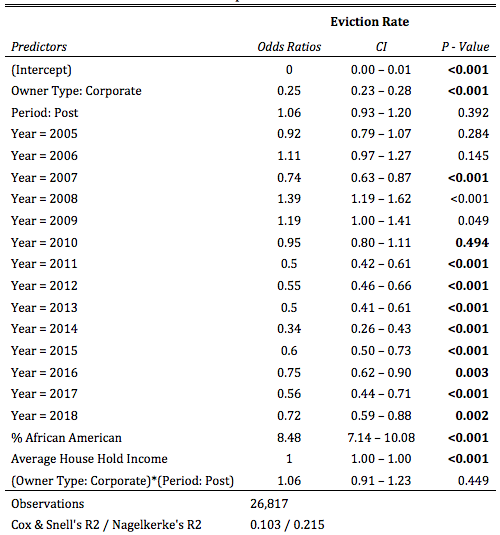
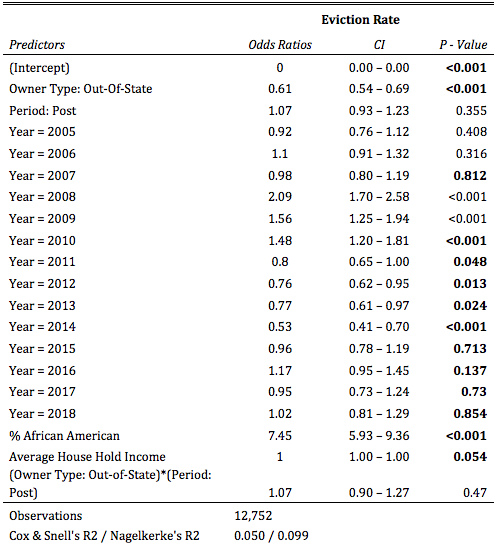
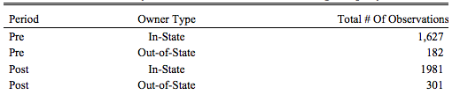
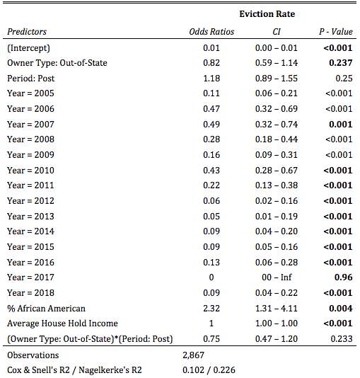

# Appendix {-}

## Appendix A: Corporate and Individual Transactions - 6-Month Windows


```r
library(knitr)
include_graphics(path = "Figures/A1.png")
```

<div class="figure">

<p class="caption">Eviction Likelihoods in All Properties</p>
</div>


```r
include_graphics(path = "Figures/A2.png")
```

<div class="figure">

<p class="caption">Eviction Likelihoods in Tiny Properties (2-4 Units)</p>
</div>


```r
include_graphics(path = "Figures/A3.png")
```

<div class="figure">

<p class="caption">Total # of Monthly Eviction Rate Observations for Tiny Property Transactions</p>
</div>


```r
include_graphics(path = "Figures/A4.png")
```

<div class="figure">

<p class="caption">Eviction Likelihoods in Medium & Small Properties (5-49 Units)</p>
</div>


```r
include_graphics(path = "Figures/A5.png")
```

<div class="figure">

<p class="caption">Total # of Monthly Eviction Rate Observations for Medium & Small Property Transactions</p>
</div>


```r
include_graphics(path = "Figures/A6.png")
```

<div class="figure">

<p class="caption">Eviction Likelihoods in Largest Properties (50+ Units)</p>
</div>


```r
include_graphics(path = "Figures/A7.png")
```

<div class="figure">

<p class="caption">Total # of Monthly Eviction Rate Observations for Large Property Transactions</p>
</div>


```r
include_graphics(path = "Figures/A8.png")
```

<div class="figure">

<p class="caption">Eviction Likelihoods Without LLC, LP or LLPs Considered (Robustness Check)</p>
</div>

## Appendix B: Out-of-State and In-State Corporate Transactions - 6-Month Window


```r
include_graphics(path = "Figures/B1.png")
```

<div class="figure">

<p class="caption">Eviction Likelihoods in All Properties</p>
</div>


```r
include_graphics(path = "Figures/B2.png")
```

<div class="figure">

<p class="caption">Eviction Likelihoods in Tiny Properties (2-4 Units)</p>
</div>


```r
include_graphics(path = "Figures/B3.png")
```

<div class="figure">

<p class="caption">Total # of Monthly Eviction Rate Observations for Tiny Property Transactions</p>
</div>


```r
include_graphics(path = "Figures/B4.png")
```

<div class="figure">

<p class="caption">Eviction Likelihoods in Medium & Small Properties (5-49 Units)</p>
</div>


```r
include_graphics(path = "Figures/B5.png")
```

<div class="figure">

<p class="caption">Total # of Monthly Eviction Rate Observations for Medium & Small Property Transactions</p>
</div>


```r
include_graphics(path = "Figures/B6.png")
```

<div class="figure">

<p class="caption">Eviction Likelihoods in Largest Properties (50+ Units)</p>
</div>


```r
include_graphics(path = "Figures/B7.png")
```

<div class="figure">

<p class="caption">Total # of Monthly Eviction Rate Observations for Large Property Transactions</p>
</div>

## Appendix C: Large and Small Investor Transactions (6-Month Window)


```r
include_graphics(path = "Figures/C1.png")
```

<div class="figure">

<p class="caption">Eviction Likelihoods Across All Properties</p>
</div>

