# Appendix {-}

## Appendix A: Corporate and Individual Transactions - 6-Month Windows

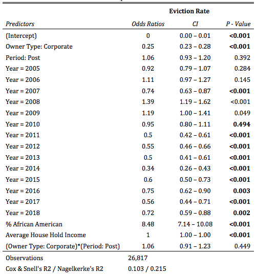

Eviction Likelihoods in All Properties

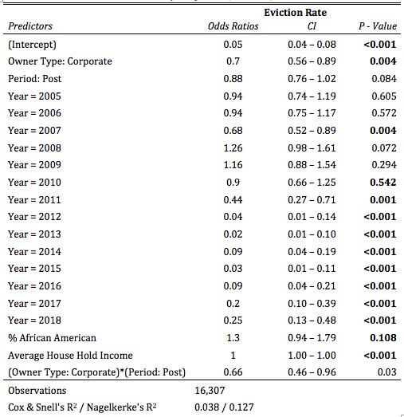

Eviction Likelihoods in Tiny Properties (2-4 Units)

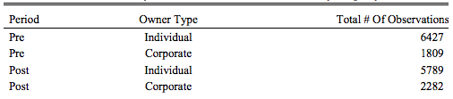

Total # of Monthly Eviction Rate Observations for Tiny Property Transactions

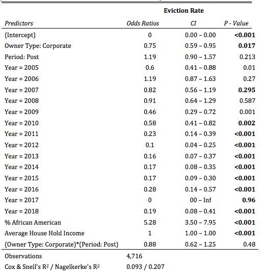

Eviction Likelihoods in Medium & Small Properties (5-49 Units)

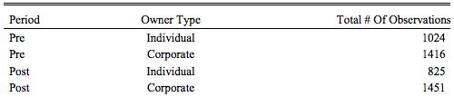

Total # of Monthly Eviction Rate Observations for Medium & Small Property Transactions

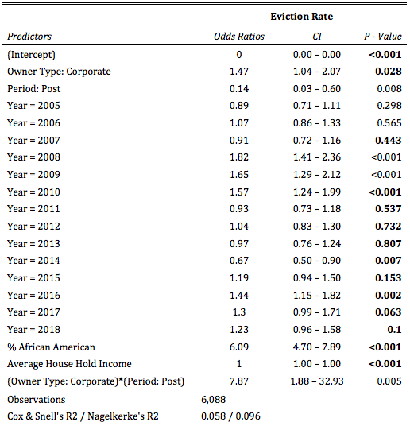

Eviction Likelihoods in Largest Properties (50+ Units)

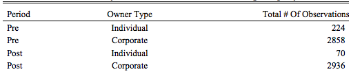

Total # of Monthly Eviction Rate Observations for Large Property Transactions

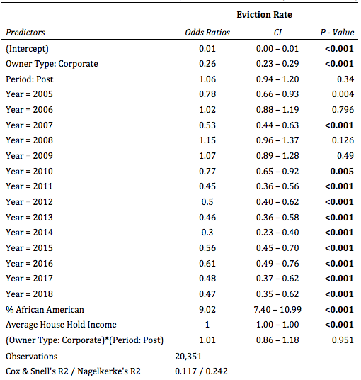

Eviction Likelihoods Without LLC, LP or LLPs Considered (Robustness Check)

## Appendix B: Out-of-State and In-State Corporate Transactions - 6-Month Window

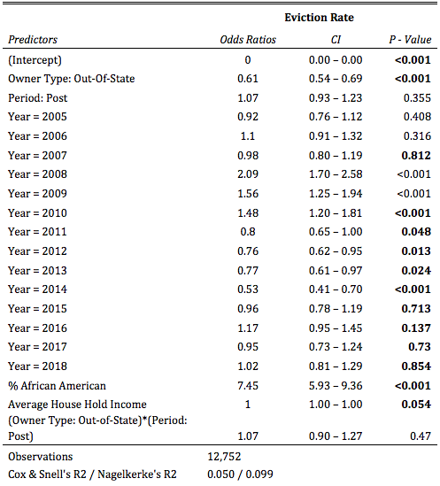

Eviction Likelihoods in All Properties

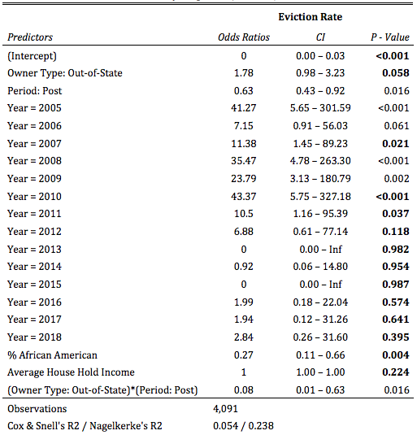

Eviction Likelihoods in Tiny Properties (2-4 Units)

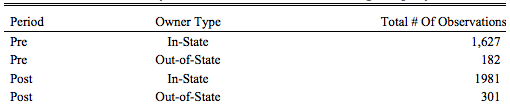

Total # of Monthly Eviction Rate Observations for Tiny Property Transactions

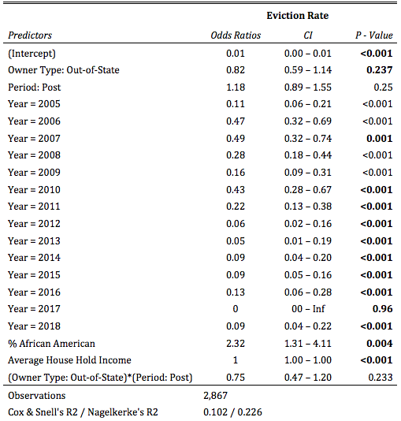

Eviction Likelihoods in Medium & Small Properties (5-49 Units)

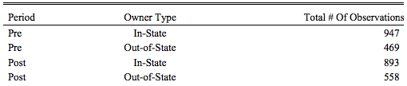

Total # of Monthly Eviction Rate Observations for Medium & Small Property Transactions

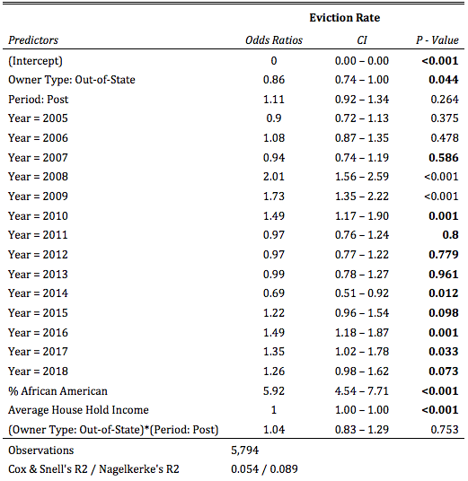

Eviction Likelihoods in Largest Properties (50+ Units)

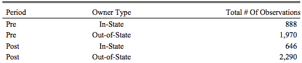

Total # of Monthly Eviction Rate Observations for Large Property Transactions

## Appendix C: Large and Small Investor Transactions (6-Month Window)

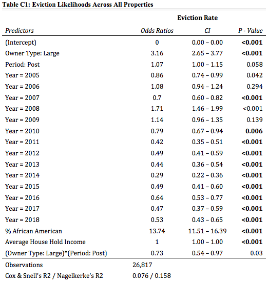

Eviction Likelihoods Across All Properties

